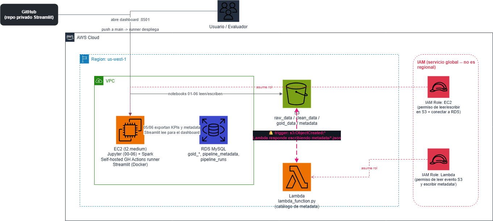

# Proyecto Integrador — Pipeline de Datos NYC TLC en AWS

Pipeline de datos end-to-end sobre los viajes de taxi de la ciudad de Nueva York (NYC TLC),
construido como Proyecto Integrador de la capacitacion de Xideral en Ingenieria de Datos con AWS. Cubre los 4 tipos de taxi que
publica la TLC (`yellow`, `green`, `fhv`, `fhvhv`), desde ingesta cruda hasta un dashboard
interactivo, usando una arquitectura medallón (Bronze → Silver → Gold) en AWS.

**Autor:** Alan Miguel Crispin Rivera

---

## Arquitectura

> 📌 Diagrama completo en `docs/architecture.png` (draw.io) 


```
NYC TLC (datos públicos)
        │
        ▼
   raw_data/          <- Bronze: parquet crudo, tal cual lo publica la TLC
        │  (03 - PySpark: limpieza, tipos, columnas derivadas, sentinela -1)
        ▼
   clean_data/        <- Silver: 4 tipos de taxi, esquema normalizado
        │  (04 - PySpark: joins/agregaciones incrementales por tipo)
        ▼
   gold_data/         <- Gold: 7 resultados agregados (KPIs)
        │  (05 + 06 - pandas/boto3)
        ▼
   RDS (MySQL)         <- tablas gold_* + metadata + registro de ejecuciones
        │
        ▼
   Streamlit Dashboard <- 5 pestañas - 8 gráficas
```

Todo el almacenamiento de datos (crudo, limpio, agregado) vive en S3
(`xideralaws-curso-proyecto-alan`, `us-west-1`). RDS **nunca** almacena el dataset
completo — solo los agregados finales (cientos/miles de filas) y metadata de control.

---

## Stack tecnológico

| Componente | Uso en este proyecto |
|---|---|
| **S3** | Almacenamiento de las 3 capas (Bronze/Silver/Gold), arquitectura medallón |
| **EC2** | Instancia t2.medium — Jupyter, PySpark, self-hosted GitHub Actions runner |
| **Lambda** | Se dispara por evento de S3 cuando llega un archivo nuevo a `raw_data/`; registra sus metadatos en `pipeline_metadata` |
| **PySpark / Hadoop** | Limpieza (03) y agregaciones (04) sobre los 4 datasets de taxi |
| **Pandas / NumPy** | Transformaciones ligeras, cálculo de KPIs sin Spark (05) |
| **RDS (MySQL)** | KPIs finales, catálogo de metadata, log de ejecuciones del pipeline |
| **Jupyter Notebook** | Los 7 notebooks del pipeline (00–06) |
| **Streamlit** | Dashboard interactivo, 5 pestañas, 8 gráficas |
| **Docker + docker-compose** | Empaquetado y despliegue del dashboard |
| **GitHub Actions (self-hosted)** | CI/CD: build + deploy automático del dashboard en cada push a `main` |

---

## Estructura del repositorio

```
.
├── notebooks/
│   ├── 00_orquestador.ipynb                # ver "Cómo se activa el flujo"
│   ├── 01_ingesta_datos_crudos_s3.ipynb
│   ├── 02_perfilamiento_esquemas.ipynb
│   ├── 03_etl_limpieza_spark.ipynb
│   ├── 04_joins_agregaciones_spark.ipynb
│   ├── 05_export_rds.ipynb
│   └── 06_sync_metadatos_rds.ipynb
├── lambda/
│   ├── lambda_function.py                  # handler: se dispara por evento S3, procesa 1 archivo
│   ├── test_event.json                     # evento S3 ObjectCreated de ejemplo, para probar el handler localmente
│   ├── backfill_metadata.py                # backfill de los 117 archivos previos a la Lambda
│   └── backfill_metadata.ipynb             
├── sql/
│   └── init_rds_schema.sql                 # base de datos + tablas de control
└── docs/
    ├── architecture.png                    # diagrama de arquitectura
    └── summary_en.md                       # resumen en inglés
```

---

## Los 4 tipos de taxi como "datasets complementarios"

Se usan los 4 tipos de taxi (`yellow`, `green`, `fhv`, `fhvhv`) como fuentes
**complementarias entre sí**: se comparan demanda, duración y costo entre ellos. Esto
significó normalizar 4 esquemas distintos a mano y resolver que cada uno tiene huecos
diferentes — por ejemplo, `fhv` no reporta tarifa ni propina, y ~82% de sus viajes no
traen ubicación de recogida. Esas filas no se descartaron (se hubiera perdido la mayoría
de `fhv`); se conservaron con un **valor centinela (`-1`)** y se excluyen solo en el
análisis que de verdad lo necesita (demanda geográfica).

---

## Los notebooks

| Notebook | Kernel | Qué hace |
|---|---|---|
| `01_ingesta_datos_crudos_s3` | Python 3 | Descarga los parquet crudos de la TLC y los sube a `raw_data/` en S3 |
| `02_perfilamiento_esquemas` | Python 3 | Perfila esquemas y calidad de datos de los 4 tipos de taxi |
| `03_etl_limpieza_spark` | PySpark | Limpieza, tipado, columnas derivadas (duración, día, hora), valor centinela → `clean_data/` |
| `04_joins_agregaciones_spark` | PySpark | Joins y agregaciones incrementales por tipo (evita OOM en t2.medium) → `gold_data/` |
| `05_export_rds` | Python 3 | Exporta los 7 KPIs de `gold_data/` a RDS (idempotente, `if_exists="replace"`) |
| `06_sync_metadatos_rds` | Python 3 | Sincroniza el catálogo de metadata de S3 (`pipeline_metadata`) a RDS (upsert) |
| `00_orquestador` | Python 3 | Automatiza 06→05 y registra cada corrida en `pipeline_runs` — ver siguiente sección |

**Nota sobre `03` y `04`:** son procesos de Spark computacionalmente pesados
(JVM, JARs de conectividad a S3, shuffles). En la instancia t2.medium (~4GB RAM)
del curso, la re-ejecución repetida y automática de estos pasos resultó poco confiable
por límites de memoria y de cuota de disco propios de esa instancia compartida — no por
un error de diseño del pipeline. Por eso se ejecutan deliberadamente, no dentro del
orquestador automatizado (ver siguiente sección).

---

## Cómo se activa el flujo del pipeline

El pipeline está diseñado en **dos etapas**, según qué tan caro es recalcular cada cosa:

**Etapa 1 — transformación pesada (manual / bajo demanda).**
`01 → 02 → 03 → 04`. Se disparan a mano cuando llegan datos nuevos de la TLC. No tiene
sentido recalcular Gold en automático si Silver no cambió, y son los pasos de Spark que
compiten por la RAM limitada de la instancia.

**Etapa 2 — sincronización ligera (automatizada por `00_orquestador.ipynb`).**
`06 → 05`. Ninguno usa Spark, ambos son idempotentes y solo sincronizan hacia RDS lo que
ya está calculado en S3. Esta es la parte que sí tiene sentido re-disparar seguido, y es
lo que corre el orquestador — con registro de cada corrida en `pipeline_runs`, que
alimenta la pestaña "Salud del pipeline" del dashboard.

---

## Base de datos (RDS)

Base de datos propia `proyecto_integrador_alan` en la instancia RDS MySQL del curso.

- **Tablas `gold_*`** (`gold_trips_by_day`, `gold_peak_hours`, `gold_weekday_weekend`,
  `gold_trip_duration`, `gold_fare_and_tip`, `gold_geographic_demand`,
  `gold_cross_taxi_correlation`): los 7 KPIs finales, recalculados por completo en cada
  ejecución (`if_exists="replace"`).
- **`pipeline_metadata`**: catálogo de cada archivo en `raw_data/` (bucket, key, tipo,
  año, mes, tamaño, filas), sincronizado por upsert desde `06`.
- **`pipeline_runs`**: log de cada ejecución del orquestador (notebook, estado, duración,
  error si lo hubo).

Script de creación en `sql/init_rds_schema.sql`.

**Credenciales:** nunca hardcodeadas. Los notebooks piden `MYSQL_HOST` / `MYSQL_USER` /
`MYSQL_DB` por variable de entorno o input interactivo, y la contraseña siempre con
`getpass` (nunca se guarda en el `.ipynb`). El dashboard de Streamlit las recibe como
variables de entorno inyectadas por GitHub Actions desde el environment `prod`.

---

## Dashboard (Streamlit)

5 pestañas, 8 gráficas, explicando el porqué de cada decisión de análisis:

1. **📅 Cuando se mueve la ciudad** — viajes por día, hora pico por tipo, entre semana vs. fin de semana
2. **💵 Duración y costo** — duración mediana, tarifa por milla, propina mediana
3. **📍 Dónde hay demanda** — top zonas de recogida
4. **🔗 Cómo se relacionan los 4 servicios** — heatmap de correlación entre tipos
5. **⚙️ Salud del pipeline** — métricas de `pipeline_metadata` y últimas ejecuciones de `pipeline_runs`

## CI/CD

Cada push a `main` en el repo del Streamlit dispara `.github/workflows/docker-image.yml`
en un runner self-hosted (la misma instancia EC2): construye la imagen, levanta el
contenedor con `docker-compose`, y verifica que `/_stcore/health` responda antes de dar
por exitoso el deploy.

---

## Lambda + backfill (`lambda/`)

Dos caminos que alimentan el mismo catálogo de metadata en S3, y desde ahí a RDS:

- **`lambda_function.py`** — la función real, disparada por una notificación de evento S3
  (`s3:ObjectCreated:*`) cada vez que llega un archivo Parquet nuevo a `raw_data/`. Extrae
  tipo de taxi, año y mes de la ruta/nombre del archivo, y escribe un JSON de metadata en
  `metadata/year={year}/month={month}/{archivo}.json`. `test_event.json` es un evento S3
  de ejemplo para poder probar el handler localmente sin depender de un trigger real.
- **`backfill_metadata.py`** (con su versión en notebook, `backfill_metadata.ipynb`) — un
  script aparte, **no** la Lambda: cubre los 117 archivos que ya existían en `raw_data/`
  **antes** de que la Lambda estuviera activa (el trigger de S3 solo dispara sobre objetos
  nuevos, esos 117 nunca hubieran generado su metadata por su cuenta). Reutiliza
  exactamente la misma lógica de parseo que el handler para producir el mismo esquema de
  JSON, pero marca cada registro con `registered_by: "backfill-taxi-metadata"` para poder
  distinguir en RDS qué llegó por el backfill inicial y qué por el trigger en tiempo real.
  Es idempotente: si se ejecuta dos veces, sobrescribe el mismo JSON con la misma key
  determinística, sin duplicar nada.

`06_sync_metadatos_rds.ipynb` es el paso que junta ambos caminos: lee **todos** los JSON
de `metadata/` en S3 (sin importar si los escribió la Lambda o el backfill) y los
sincroniza a la tabla `pipeline_metadata` en RDS vía upsert.

---

## Decisiones de diseño (resumen)

- **Valor centinela (`-1`)** para ubicaciones estructuralmente ausentes, en vez de descartar filas.
- **Mediana, no promedio**, para duración/tarifa/propina — menos sensible a atípicos.
- **Procesamiento incremental por tipo** en Spark (04) para no rebasar la RAM del t2.medium.
- **RDS solo para KPIs y metadata**, nunca el dataset completo.
- **Orquestador de dos etapas**: automatiza solo lo idempotente y liviano (06→05); las
  transformaciones pesadas de Spark se ejecutan deliberadamente, no en automático.
- **Sin credenciales hardcodeadas** en ningún notebook ni archivo del repo.

